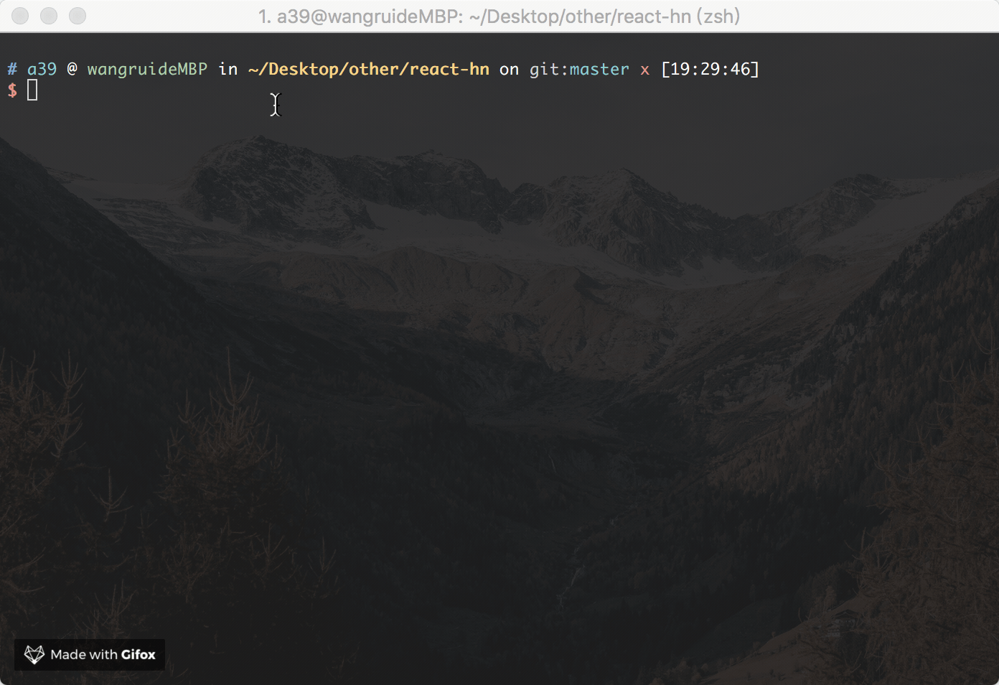

# wgit

> A CLI to keep semantic git. With emoji support 🌒🌓🌔🌕🌖🌗🌘

 Inspired by [node-semantic-git-commit-cli](https://github.com/JPeer264/node-semantic-git-commit-cli).

## preview



## Installation

```
$ npm i -g wgit-cli

or

$ yarn global add wgit-cli
```

## Usage
```
Forget the times when you used git commit -m "..."
and used git branch git checkout now just type:

$ wgit

```

## todo:
- [x] checkout
- [x] commit
- [ ] add
- [ ] rebase
- [ ] tag
- [ ] push
- [ ] pull


## License

MIT
